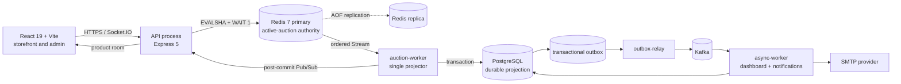
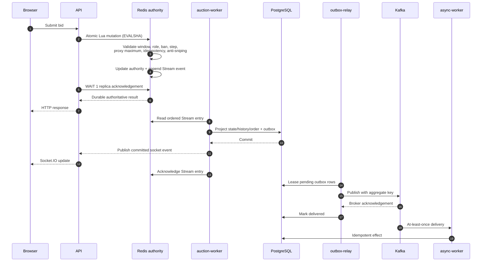

# Miracle Auction Platform

[](https://github.com/KidCute1412/miracle-auction-platform/actions/workflows/ci.yml)

A full-stack auction platform built around one difficult requirement: accepting concurrent bids quickly without losing ordering, correctness, or recoverability.

Miracle Auction combines a React storefront and administration console with a TypeScript modular monolith. Active-auction decisions are atomic in Redis; PostgreSQL stores the durable business projection; a transactional outbox and Kafka carry asynchronous work; Socket.IO delivers post-commit updates.

> This is an engineering portfolio project. It demonstrates production-oriented patterns and their tradeoffs, but does not claim unlimited scale or exactly-once delivery.

## Highlights

- Real-time bidding, proxy maxima, buy-now, anti-sniping, winner, seller, and order workflows
- Atomic Redis Lua mutations with ordered Stream events
- Idempotent PostgreSQL projection with event and per-auction sequence fences
- Transactional outbox publication to Kafka
- Retryable dashboard and email consumers with durable DLQ records
- Socket.IO updates emitted only after projection commits
- Cookie authentication, CSRF, CORS, Helmet, rate limits, RBAC, and request IDs
- Unit, API contract, integration, concurrency, frontend, and k6 test assets

## Architecture

The backend is one modular-monolith codebase and image with four composition roots. This preserves shared domain boundaries while isolating HTTP latency, ordered projection, relay, and asynchronous work.



### Bid processing



The synchronous bid request ends after Redis accepts the Lua mutation **and** the configured replica acknowledgement succeeds (`WAIT 1` in the benchmark). PostgreSQL, Kafka, Socket.IO, dashboards, and email are not part of bid HTTP latency. See the [system overview](docs/overview_system_architecture.md), [bid architecture](docs/bidding_architecture.md), and [worker failure model](docs/worker-process-architecture.md).

## Reliability model

| Concern | Design |
|---|---|
| Active-auction decisions | Redis is authoritative. A Lua script validates and mutates the complete state atomically. |
| Durable business view | PostgreSQL stores users, products, bid history, orders, outbox rows, and consumer receipts as an eventually convergent projection. |
| Ordering | One `auction-worker` consumes Redis Stream entries and projects per-auction keyed lanes; sequence/version fences preserve each auction's order. |
| Projection retries | Database failure leaves the entry pending for idempotent reclaim and retry. |
| Event publication | Projection and outbox insert commit together; delivery is recorded only after Kafka acknowledges publication. |
| Duplicate delivery | Event IDs, sequence constraints, consumer receipts, and effect-specific unique constraints suppress duplicates. |
| Poison events | Bounded retries terminate in durable DLQ records for inspection and controlled replay. |
| Live updates | Redis Pub/Sub and Socket.IO are best-effort after commit; clients reject stale versions and refetch after reconnect. |

The system provides **at-least-once delivery with idempotent effects**, not exactly-once delivery.

## Technology

| Layer | Main technology |
|---|---|
| Frontend | React 19, TypeScript, Vite 7, Tailwind CSS 4, Radix UI, Socket.IO client |
| API | Node.js 22, TypeScript, Express 5, Socket.IO |
| Persistence | PostgreSQL 15, Prisma migrations/client |
| Auction authority | Redis 7, Lua, Streams, Pub/Sub, AOF |
| Events | Kafka 3.7, KafkaJS, transactional outbox |
| Testing | Vitest, Supertest, Testcontainers, k6 |
| Operations | Docker Compose, GitHub Actions, health/readiness endpoints |

## Repository map

```text
Backend/             API, modules, Prisma schema, workers, and tests
Frontend/            React storefront and administration console
AgentService/        Repository-scoped agent service
PerformanceTests/    Repeatable k6 scenarios and benchmark artifacts
data/                Local demonstration seed data
docs/                Architecture, demo, evidence, and operating notes
.github/workflows/   CI quality gates
```

## Local development

### Prerequisites

- Node.js 22
- npm
- Docker Desktop with Docker Compose
- Windows PowerShell for the one-command launcher

External email, OAuth, CAPTCHA, Cloudinary, and editor integrations are optional for the core local auction flow.

### One-command Windows start

```powershell
Copy-Item Backend/.env.example Backend/.env
Copy-Item Frontend/.env.example Frontend/.env
.\start.bat
```

`start.bat` starts PostgreSQL, Redis, and Kafka; installs dependencies; generates Prisma; applies migrations; seeds only when the database is empty; starts all three workers; and opens backend/frontend development processes.

- Frontend: `http://localhost:5173`
- API: `http://localhost:5000`
- Liveness: `http://localhost:5000/health`
- Readiness: `http://localhost:5000/ready`

### Manual start

```powershell
docker compose up -d postgres redis kafka

Set-Location Backend
npm install
npm run prisma:generate
npm run prisma:migrate:deploy
npm run dev
```

In separate terminals:

```powershell
Set-Location Frontend
npm install
npm run dev
```

```powershell
docker compose up -d auction-worker outbox-relay async-worker
```

Use `start.bat` when you want the provided demo data; the manual commands do not import it automatically.

## Environment

Start from the committed examples:

- `Backend/.env.example` — database, Redis, Kafka, auth, providers, workers, and topics
- `Frontend/.env.example` — API URL and optional browser integrations
- `AgentService/.env.example` — agent service configuration

Production secrets must be injected by the deployment environment. Never commit `.env` files, JWT secrets, provider keys, SMTP credentials, or database passwords.

## Verification

CI runs separate gates for the backend, frontend, AgentService, Compose definitions, and production image.

```powershell
Set-Location Backend
npm run build
npm run test:unit
npm run test:contracts
npm run test:coverage

Set-Location ../Frontend
npm run lint
npm test
npm run build

Set-Location ../AgentService
npm run build
npm test

Set-Location ..
docker compose config
docker compose --env-file Backend/.env.example -f compose.production.yml config
```

Database and concurrency tests use isolated Testcontainers rather than shared development data. See [engineering evidence](docs/engineering-evidence.md) for current results and benchmark provenance.

## Security notes

- Access and refresh tokens use secure cookie flows; authorization remains server-side.
- State-changing browser requests pass CSRF validation.
- CORS is restricted to the configured client origin; Helmet supplies baseline security headers.
- Global and authentication-specific rate limits protect sensitive endpoints.
- Bid rules, seller restrictions, bidder bans, winner permissions, and admin actions are enforced by backend use cases.
- Request IDs are returned and propagated as correlation IDs where supported.
- Live external providers are excluded from deterministic tests and benchmarks.

This is not a security certification. Refresh-token reuse tests, broader audit coverage, secret-redaction tests, and a complete OWASP review remain roadmap work.

## Performance evidence

The selected bid-core benchmark is a three-run local, isolated Docker/k6 measurement using **100 VUs for 75 seconds**, one Redis auction shard, Redis AOF, Lua validation, idempotency, replica acknowledgement (`WAIT 1`), projection, and post-run core invariants:

| Scenario | Throughput median | Accepted bids/s | p95 | p99 | Infrastructure errors | Throughput CV |
|---|---:|---:|---:|---:|---:|---:|
| `bid-path` + `bid-priority` | **309.33 req/s** | **275.16** | **536.57 ms** | **689.85 ms** | **0%** | **1.89%** |

All three runs passed Redis/PostgreSQL convergence, Stream/outbox drain, ordering, and idempotency invariants. `bid-path` excludes dashboard and notification consumers, so it measures the durable bidding core rather than end-to-end downstream capacity. It is local benchmark evidence, not a production SLA or a claim of unlimited scale. Reproduce it with:

```powershell
cd PerformanceTests
npm.cmd run benchmark:bid-path -- --resource-profile=bid-priority --redis-shards=1
```

`distributed` keeps downstream consumers enabled and is the production-like companion scenario. See [PerformanceTests](PerformanceTests/README.md) and [engineering evidence](docs/engineering-evidence.md) for thresholds, artifacts, and interpretation.

## Demo and media

Follow the [five-minute demo guide](docs/demo-guide.md) to present product discovery, live bidding, winner/order behavior, administration, and engineering evidence. Real UI captures belong under `docs/assets/`; mockups are not accepted as portfolio evidence.

| Storefront | Active auction |
|---|---|
|  |  |

## Tradeoffs and limits

- One sequential projector preserves ordering but limits projection throughput.
- Redis outages reject bid mutations; PostgreSQL is deliberately not a fallback because dual authorities risk divergence.
- PostgreSQL and dashboards converge asynchronously, so operational lag must be monitored.
- Pub/Sub can lose transient updates; reconnecting clients refetch canonical state.
- Kafka and SMTP are at-least-once. Idempotency prevents duplicate business effects, but email acceptance cannot be transactional with PostgreSQL.
- Fixed-date catalog seeds must be refreshed when their auction windows no longer fit the demonstration date.
- Admins can run a read-only Redis/PostgreSQL reconciliation for an active auction; automated repair remains deliberately out of scope until a maintenance-mode workflow and verified checkpoint are in place.
- The frontend does not yet have the complete Playwright workflow suite in the roadmap.

## Documentation

- [Five-minute demo](docs/demo-guide.md)
- [Engineering evidence](docs/engineering-evidence.md)
- [Current architecture](docs/overview_system_architecture.md)
- [Redis-authoritative bidding](docs/bidding_architecture.md)
- [Worker architecture and failures](docs/worker-process-architecture.md)
- [Modular monolith boundaries](docs/modular_monolith_architecture.md)
- [Deployment and recovery](docs/deployment.md)
- [API contracts](docs/api-route-contracts.md)
- [Current roadmap](docs/reflourish_plan.md)

## License

The backend package declares ISC. Add a root `LICENSE` file before presenting the entire repository as formally licensed.
