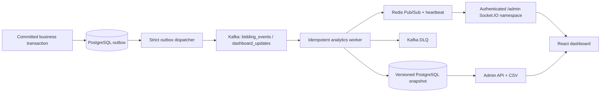

# Admin analytics pipeline



## Metric definitions

- `completedOrderGmvVnd`: sum of immutable `orders.amount_vnd` where `order_status = 'finished'` and `completed_at` is inside the selected range.
- `activeBidders`: distinct bidders with a bid inside the selected range.
- `enabledAccounts`: accounts whose durable status is `active`; this is intentionally not labelled active users.
- `activeAuctions`: non-removed `ACTIVE` auctions whose start/end window contains the current time.
- Sell-through rate: ended, non-removed auctions with a winner divided by all ended, non-removed auctions.
- Category and heatmap series are PostgreSQL aggregations. No commission model or platform-revenue metric is claimed.

## Failure behavior

| Failure | Expected behavior |
|---|---|
| Kafka unavailable | Outbox rows remain undelivered; scheduled snapshot refresh continues. |
| Redis unavailable | PostgreSQL snapshot commits; API polling remains available. |
| PostgreSQL unavailable | The worker does not commit the Kafka offset. |
| Repeated event failure | Attempts survive restart; the fifth failure is stored terminally and acknowledged only after DLQ publish. |
| Socket disconnected | The frontend polls every 60 seconds and marks snapshots stale after the configured threshold. |

## Rollout and rollback

1. Run `npm run prisma:migrate:deploy` from `Backend`.
2. Deploy backend and worker with the three Kafka topics provisioned.
3. Verify `/ready`, worker heartbeat, outbox depth, consumer lag and a manual version-based sync.
4. Deploy the frontend.

Rollback application containers independently. The migration is additive and old application versions ignore the added columns/tables. Do not remove analytics columns, receipts, outbox rows or audit data during an application rollback.

## Verification

```powershell
cd Backend
npm run build
npm run test:unit
npm run test:contracts
npm run test:database

cd ../Frontend
npm run lint
npm run build

cd ..
docker compose config
```
