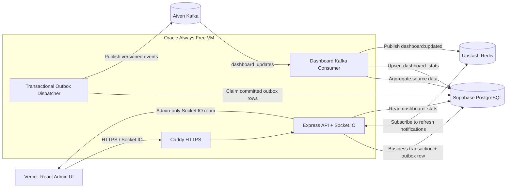

# Admin Dashboard: CV-Ready Architecture and Implementation Plan

> Runtime status (2026-07-29): the current dashboard consumer and scheduled recovery run inside `async-worker`. Redis is Oracle-local, outbox publication belongs to `outbox-relay`, and terminal events use `async_events_dlq`. Any older topology below is design history; [worker-process-architecture.md](worker-process-architecture.md) is canonical.

## 1. Goal

Build a **near-real-time, CQRS-style analytics read model** that demonstrates:

- transactional outbox reliability
- managed Kafka event streaming
- idempotent and debounced background processing
- pre-aggregated PostgreSQL read models
- authenticated Socket.IO updates
- operational monitoring, auditability, and measured performance

The production pipeline uses Aiven Free Kafka. PostgreSQL remains the source of truth, and Kafka never decides whether a bid, payment, order, or user update is valid.

## 2. Target Production Architecture



### Component responsibilities

| Component | Responsibility |
| --- | --- |
| React admin UI | KPIs, charts, audit log, operations, reports, freshness and error states |
| Express API | Admin RBAC, snapshot endpoints, manual sync, socket authentication |
| Outbox dispatcher | Reliably publish committed domain events to Aiven Kafka |
| Dashboard worker | Consume, coalesce, aggregate, retry, write snapshots, report heartbeat |
| PostgreSQL | Business truth, transactional outbox, audit log, analytics snapshot |
| Aiven Kafka | Event transport, consumer groups, short-term replay, dashboard DLQ |
| Redis | Worker/API notification, debounce lock, heartbeat; not dashboard truth |

## 3. Correct Event Flow

### Domain-triggered refresh

1. A relevant transaction changes business state.
2. The same PostgreSQL transaction writes a versioned outbox event.
3. The dispatcher claims only committed rows with `FOR UPDATE SKIP LOCKED`.
4. After Kafka acknowledges publication, the dispatcher marks the outbox row delivered.
5. The dashboard consumer receives events from `dashboard_updates`.
6. Events in a 10-30 second window are coalesced into one refresh.
7. A single-flight guard prevents overlapping full refreshes.
8. The worker calculates metrics and commits a new `dashboard_stats/summary` version.
9. The worker publishes `dashboard:updated` through Redis.
10. The API emits a small notification to authenticated admin sockets.
11. The frontend fetches the authoritative snapshot from the API.

Relevant versioned events:

```text
bid.placed.v1
auction.completed.v1
order.completed.v1
order.cancelled.v1
seller.verified.v1
product.removed.v1
dashboard.refresh_requested.v1
```

Every event envelope contains:

```text
eventId
eventType
eventVersion
aggregateId
occurredAt
correlationId
safe payload
```

### Manual refresh

`POST /api/admin/dashboard/sync` writes `dashboard.refresh_requested.v1` to the transactional outbox and returns `202 Accepted` with an event ID. The request does not wait for aggregation.

### Recovery refresh

The worker also performs a refresh every 60 seconds. This keeps time-dependent metrics current and repairs delayed events when Aiven Kafka has been idle or unavailable.

## 4. Kafka Design

Target topics:

| Topic | Purpose |
| --- | --- |
| `bidding_events` | Existing committed auction side effects |
| `dashboard_updates` | Dashboard invalidation and manual refresh events |
| `dashboard_updates_dlq` | Malformed or terminally failing dashboard messages |

Use consumer group `dashboard-analytics-v1`.

Processing rules:

- expect at-least-once delivery and tolerate duplicates
- commit offsets only after the PostgreSQL snapshot succeeds
- retry transient failures with bounded exponential backoff
- send terminal failures to the DLQ with original event metadata and safe error details
- continue Kafka heartbeats while coalescing or processing a long refresh
- log topic, partition, offset, event ID, attempt, duration, and result
- stay within Aiven Free Kafka's five-topic, two-partition, throughput, and retention limits

The PostgreSQL outbox is still required. Publishing directly to Kafka after a business commit creates a crash window in which the event can be lost.

## 5. PostgreSQL Read Model

Store one versioned snapshot under `dashboard_stats/summary`:

```text
key
value JSONB
version
updated_at
refresh_duration_ms
source_event_count
```

The API normally performs one small snapshot read. If no snapshot exists, it may run a one-time live fallback and request an asynchronous refresh.

Do not add a Redis copy of this snapshot until a repeatable benchmark proves PostgreSQL is a bottleneck.

## 6. CV-Strong Dashboard Features

### Business intelligence

- paid/completed-order GMV with a documented definition
- platform revenue when a real commission model exists
- auction completion and sell-through rates
- bid volume and unique active bidders
- completed, pending, cancelled, and disputed orders
- pending seller verification and moderation workload
- current-period versus previous-period changes
- 7-day, 30-day, 3-month, 6-month, and 1-year trends

Do not label enabled accounts as "active users." Define activity using a real time window or use "enabled accounts."

### Real-time administration

- authenticated admin-only Socket.IO room
- snapshot version, last-updated time, and stale-data warning
- connection and reconnect state
- automatic snapshot refetch after a refresh notification
- manual sync progress based on snapshot version, not a fixed timeout

### Operational monitoring

- worker heartbeat and last successful refresh
- refresh duration and freshness delay
- transactional outbox pending and retry counts
- Kafka consumer lag, retry count, and DLQ count
- PostgreSQL, Redis, and Kafka readiness
- Socket.IO connection status

Every status must come from a real check. Remove hard-coded "Operational" labels.

### Security and audit

- filterable, paginated admin audit log
- actor, action, resource, result, timestamp, and correlation ID
- product removals, bidder bans, seller approvals, role changes, and job retries
- safe metadata only; never store passwords, tokens, cookies, or secrets

### Reporting

- CSV export for filtered analytics and audit results
- optional scheduled daily or weekly report generated by the worker
- report generation recorded as an auditable background job

## 7. API and Socket Contracts

```text
GET  /api/admin/dashboard?range=30d
POST /api/admin/dashboard/sync
GET  /api/admin/dashboard/operations
GET  /api/admin/audit-logs
GET  /api/admin/dashboard/dlq
POST /api/admin/dashboard/dlq/:eventId/retry
GET  /api/admin/dashboard/export.csv
```

All routes require the admin role.

Socket rules:

- authenticate during the connection handshake
- join the `admin` room on the server; clients cannot select it
- emit only `version`, `updatedAt`, `reason`, and `correlationId`
- refetch the snapshot after reconnect because socket delivery is not durable
- register listeners once and clean them up on unmount

## 8. Failure and Recovery Model

| Failure | Expected behavior |
| --- | --- |
| Kafka unavailable | PostgreSQL outbox retains events; scheduled refresh continues |
| Worker unavailable | Kafka retains events within retention; restart resumes the consumer |
| Redis unavailable | Snapshot still updates; live push pauses; UI can refetch |
| PostgreSQL unavailable | Refresh fails without offset commit and retries later |
| Duplicate Kafka event | Recalculation remains correct and notifications are coalesced |
| Malformed event | Bounded retries, then DLQ with inspection metadata |
| Socket disconnect | Client reconnects and fetches the latest snapshot version |

Graceful shutdown stops new work, waits for the active batch, then closes Kafka, Redis, and PostgreSQL connections.

## 9. Implementation Phases

### Phase 1 - Correctness and event contracts

- define every metric from actual domain states
- generalize the existing auction outbox or add a multi-topic domain outbox safely
- add topic routing and versioned dashboard event envelopes
- change manual sync to a durable outbox event returning `202`
- make publisher failures escape so outbox rows remain retryable

### Phase 2 - Resilient dashboard worker

- add Aiven Kafka consumer configuration
- implement batching, 10-30 second coalescing, and single-flight refresh
- add retry, DLQ, recovery schedule, heartbeat, and graceful shutdown
- add snapshot version and refresh metadata

### Phase 3 - Authenticated live dashboard

- publish refresh completion through Redis
- add authenticated admin Socket.IO rooms
- replace fixed refresh timeout with version-based completion
- add typed loading, error, empty, success, reconnect, and stale states

### Phase 4 - Operations, audit, and reports

- implement real service health and consumer-lag data
- add admin audit logs, DLQ inspection, and safe retry
- add CSV export and optional scheduled reports

### Phase 5 - Portfolio evidence

- capture a real dashboard screenshot or GIF
- document the event lifecycle and failure recovery
- save test reports and benchmark artifacts
- link architecture, tests, demo, and performance evidence from the README

## 10. Required Tests

### Unit

- metric definitions and comparison periods
- event envelope validation and topic routing
- debounce and single-flight behavior
- snapshot freshness and stale-state calculation

### Integration

- business write and outbox insert are atomic
- duplicate delivery remains safe
- publisher failure leaves the outbox retryable
- offsets are not committed after aggregation failure
- retries reach the DLQ after the configured limit
- Kafka, Redis, worker, and PostgreSQL outage recovery
- non-admin API and socket access is rejected

### Frontend and performance

- socket update, reconnect, listener cleanup, and snapshot refetch
- loading, error, empty, success, and stale UI states
- repeatable k6 comparison of live aggregation versus snapshot reads
- saved p50/p95 latency, error rate, freshness delay, dataset, and environment

## 11. Acceptance Criteria

- normal dashboard reads use the PostgreSQL snapshot
- business changes and their outbox events commit atomically
- bursts produce at most one refresh per debounce window
- duplicate events cannot corrupt metrics or create notification storms
- only authenticated admins receive dashboard data and socket events
- broker or Redis outages degrade safely without losing committed business data
- operations and audit views use real backend data
- tests, frontend lint/build, Compose validation, and deployment smoke checks pass
- CV performance claims are supported by committed benchmark artifacts

## 12. CV Description

Use this before performance measurements:

> Built a near-real-time admin analytics pipeline using a PostgreSQL transactional outbox, Aiven Kafka, a debounced Node.js worker, a versioned JSONB read model, Redis Pub/Sub, and authenticated Socket.IO, with idempotent consumption, retry, DLQ, audit, and graceful-degradation behavior.

After repeatable benchmarks, add measured p95 dashboard latency, freshness delay, and query-load reduction. Never claim a percentage or latency that is not backed by saved evidence.
