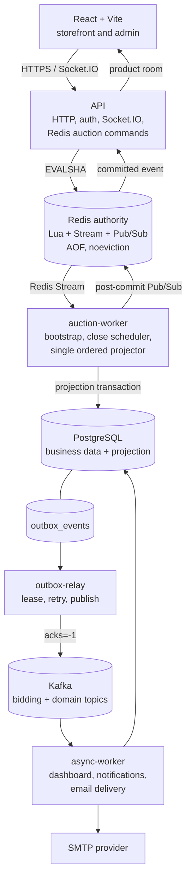
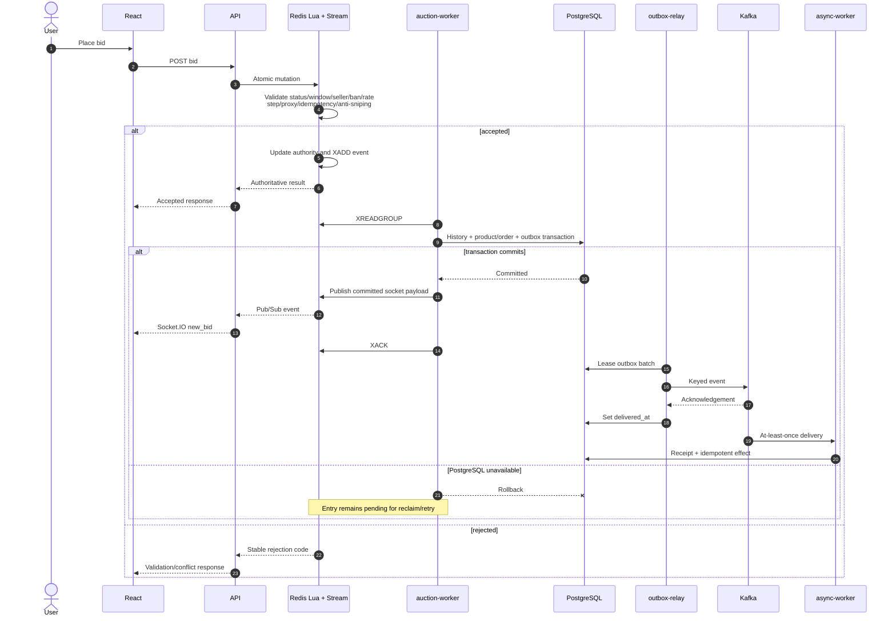

# Current system architecture

Miracle Auction is a modular monolith with four Node.js composition roots built from one backend codebase and image. Process separation isolates HTTP latency, ordered auction projection, outbox publication, and asynchronous consumers without splitting domain ownership across services.

## Runtime topology

Local development uses Docker Compose for PostgreSQL, Redis, Kafka, and the three worker processes. Provider choices in `compose.production.yml` are deployment details, not domain boundaries.

## Process ownership

| Process | Owns | Does not own |
|---|---|---|
| `api` | HTTP, authentication/security, Socket.IO, Redis Lua mutations, new-auction bootstrap | Stream projection, close scheduling, Kafka production, auction email delivery |
| `auction-worker` | missing-state bootstrap, close scheduler, sequential projection, pending-entry reclaim, heartbeat | HTTP, Kafka consumption, SMTP |
| `outbox-relay` | outbox leasing, retry scheduling, Kafka publication, heartbeat | auction decisions, Socket.IO, email rendering |
| `async-worker` | dashboard consumption, notification intake, durable email delivery and recovery | bid decisions, closing, Stream projection |

Only one `auction-worker` replica is supported. Horizontal projection requires partitioning by auction and proof that per-auction ordering survives rebalances and crashes.

## Bid-processing sequence

## Data authority

Redis is authoritative for active-auction mutation decisions. PostgreSQL is the durable business store and eventually convergent auction projection:

- The API never uses PostgreSQL as a hidden bidding fallback.
- Redis atomically updates authority and appends the matching Stream event.
- Projection uniqueness on event ID and `(product_id, sequence)` prevents duplicate or out-of-order history.
- Product, history, order state, and the canonical outbox record commit together.
- A Stream entry is acknowledged only after the transaction commits.

## Delivery and recovery

The transactional outbox prevents a committed database change from being lost between PostgreSQL and Kafka. The relay claims work with a lease, publishes with broker acknowledgement, and sets `delivered_at` afterward. A crash after broker acknowledgement can duplicate publication, so consumers record receipts and enforce effect-specific uniqueness.

Consumer offsets are committed only after durable handling. Retryable failures use bounded backoff; terminal consumer and email failures create durable DLQ events for inspection and controlled replay.

Socket.IO has a different guarantee. Projection publishes through Redis Pub/Sub after commit. Pub/Sub is best-effort, so frontend listeners reject stale sequence/version pairs and refetch after reconnect.

## Failure behavior

| Failure | Expected result |
|---|---|
| Redis unavailable | Mutation returns service unavailable; PostgreSQL does not take authority. |
| PostgreSQL unavailable after Redis accepts | The Stream event remains pending until projection succeeds. |
| Pub/Sub unavailable after projection | Durable state remains committed; clients recover by refetching. |
| Kafka unavailable | Bid API remains independent; outbox rows retry. |
| Duplicate Kafka delivery | Receipts and unique constraints suppress duplicate effects. |
| SMTP unavailable | Durable delivery rows retry; terminal attempts create an async DLQ event. |
| Worker restart | Leases expire, pending entries are reclaimed, and replay remains idempotent. |

## Operations

- `/health` reports API liveness.
- `/ready` checks PostgreSQL, Redis, and a fresh auction-worker heartbeat; Kafka status is reported but does not control readiness.
- Worker heartbeats, projection lag, Stream pending entries, outbox state, email state, consumer lag, and DLQ totals support diagnosis.
- Graceful shutdown stops new work before closing Redis, Kafka, Socket.IO, and database connections.

See [worker-processes.md](worker-processes.md) for contracts and lifecycle, [bidding.md](bidding.md) for the hot path, and [deployment](../operations/deployment.md) for rollout and recovery.
