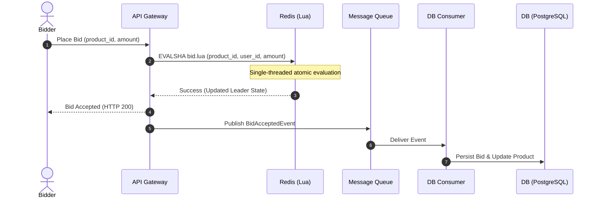

# High-Throughput & Strongly Consistent Bidding Architecture

This document describes the architectural transition from relational pessimistic database locking to an in-memory validation and asynchronous write-behind system for high-concurrency auctions.

---

## 1. The Core Problem: Pessimistic Locking Bottleneck

In the current implementation, every bid triggers:
1. `SELECT FOR UPDATE` on the `products` table.
2. `SELECT FOR UPDATE` on the `bidding_history` table.
3. Database writes (`INSERT` and `UPDATE`) within a serializable transaction block.

### Why this fails under high throughput:
* **Database I/O Wait**: Relational databases write to disk to maintain ACID guarantees. disk operations are slow.
* **Row Lock Contention**: If thousands of users bid on the same popular product simultaneously, they queue behind each other on the exact same row lock.
* **Connection Exhaustion**: Requests hold DB connections open while waiting for locks, leading to timeout errors and system-wide cascades.

---

## 2. The Solution: In-Memory Validation + Write-Behind

To achieve both **high throughput (100k+ req/sec)** and **strong consistency**, we split the operation into two phases:



### Phase 1: Synchronous In-Memory Validation (Redis)
* Active auction details (current highest bid, price owner, step price, end time) are cached in Redis.
* Validations (checking if the bid is higher than the current price, if the auction is active) are done inside Redis.
* If valid, Redis updates the cached auction state and returns success to the client immediately.

### Phase 2: Asynchronous Durability (Message Queue + DB)
* The API Gateway publishes a message to a queue.
* A background consumer pulls the message and inserts the history into PostgreSQL.

---

## 3. Technology Analysis & Comparisons

### Why Redis?
* **Single-Threaded Execution**: Redis runs command sequences on a single thread. When logic is wrapped in a **Lua script**, Redis executes it atomically. No two scripts can run concurrently, preventing double-bidding/race conditions.
* **Sub-millisecond Latency**: Operations run entirely in RAM.

### Why a Message Queue (Kafka vs. RabbitMQ)?
The queue decouples the fast frontend (Redis) from the slower backend database write.

| Feature | Kafka (Recommended for Scale) | RabbitMQ (Good Alternative) |
| :--- | :--- | :--- |
| **Ordering** | Guarantees ordering per partition (e.g., using `product_id` as the partition key). | Message ordering is guaranteed per queue, but harder to scale horizontally without multiplexing queues. |
| **Throughput** | High throughput via sequential disk log appending. | High throughput, but degrades if queue sizes grow very large. |
| **Persistence** | Log compaction and event replayability out-of-the-box. | Messages are deleted after consumer acknowledgment. |

* **Can you use RabbitMQ?** Yes. For standard workloads, RabbitMQ is simpler to set up and manage. Simply route bids using a routing key based on `product_id` to ensure strict processing sequence.

---

## 4. Lua Script Example (Redis Validation)

This script validates and updates the bid state inside Redis:

```lua
-- Keys: KEYS[1] = product_bids_key (hash)
-- Args: ARGV[1] = user_id, ARGV[2] = bid_amount, ARGV[3] = step_price, ARGV[4] = end_time

local current_price = tonumber(redis.call('HGET', KEYS[1], 'current_price') or 0)
local current_owner = redis.call('HGET', KEYS[1], 'price_owner_id')
local auction_end = tonumber(redis.call('HGET', KEYS[1], 'end_time') or 0)
local now = tonumber(ARGV[4])

-- Validate auction end time
if now > auction_end then
    return {err = "Auction ended"}
end

-- Validate step increment
local min_valid_bid = current_price + tonumber(ARGV[3])
if tonumber(ARGV[2]) < min_valid_bid then
    return {err = "Bid too low"}
end

-- Update new leader
redis.call('HSET', KEYS[1], 'current_price', ARGV[2], 'price_owner_id', ARGV[1])
return {ok = "Bid accepted", current_price = ARGV[2]}
```

---

## 5. Resume & CV Highlights (Standout Features)

To make this architecture a highlight on your CV, discuss how you solved these real-world edge cases:

1. **Redis Cache-DB Reconciliation / Anti-Entropy**:
   * What if the database consumer crashes or fails?
   * *CV Highlight*: "Implemented a reconciliation cron job (outbox pattern) that periodically compares PostgreSQL records against Redis key-states to heal discrepancies."
2. **Dynamic Auction Extensions ("Sniper Protection")**:
   * If a bid comes in during the last 30 seconds of an auction, the end time must extend by 2 minutes. Doing this in Redis requires updating the hash fields and returning the new end time in real-time.
   * *CV Highlight*: "Built a sliding-window bidding deadline manager utilizing Redis Lua scripting to prevent sniping attacks."
3. **Idempotency Control**:
   * Network retries might cause duplicate bids.
   * *CV Highlight*: "Enforced exact-once bid semantics by using Redis hashes to deduplicate incoming bid transactions based on idempotent request tokens."
4. **Graceful Degradation / Fallbacks**:
   * If Redis crashes, how does the system recover?
   * *CV Highlight*: "Implemented a fallback policy routing traffic directly to PostgreSQL read-replicas with rate limiters when cache layers became unavailable."
