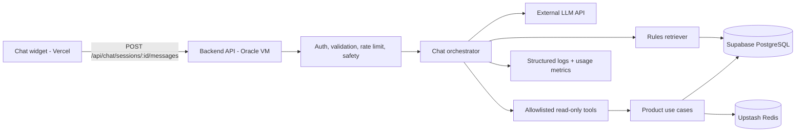

# Kế hoạch và quyết định triển khai chatbot AI

> Mục tiêu của tài liệu: trả lời câu hỏi **có nên triển khai chatbot cho Online Auction hay không**, thay vì mặc định rằng có AI là tốt.
>
> Ngày đánh giá: 25/07/2026.

## 1. Kết luận ngắn

**Khuyến nghị có điều kiện: chỉ triển khai khi làm được chatbot có grounding, tool calling, đánh giá chất lượng và kiểm soát vận hành. Không nên ưu tiên nếu phạm vi chỉ là một cửa sổ chat gọi trực tiếp API LLM.**

| Phương án | Giá trị sản phẩm | Giá trị CV | Công sức | Khuyến nghị |
|---|---:|---:|---:|---|
| UI chat + gọi API LLM và trả văn bản | 3/10 | 2-3/10 | Thấp | **Không làm** |
| LLM + tool tìm/đọc sản phẩm thật | 6/10 | 6/10 | Trung bình | Chỉ làm nếu còn thời gian |
| Tool calling + RAG quy định + citations + eval + observability | 8/10 | 8/10 | Trung bình-cao | **Phương án nên làm** |
| Tự host model trên Oracle VM hiện tại | 3/10 | 5/10 | Cao, rủi ro vận hành cao | **Không phù hợp** |

Repo hiện đã có những tín hiệu kỹ thuật mạnh hơn một chatbot đơn giản: auction concurrency, Redis/Lua, Kafka/worker, outbox/idempotency, Socket.IO, kiểm thử tích hợp và một `AgentService` multi-agent dành cho development automation. Vì vậy, một wrapper LLM đơn giản có thể làm portfolio bị loãng thay vì nổi bật.

**Quyết định đề xuất:**

- Làm sau khi luồng deploy hiện tại đã chạy ổn định và có demo end-to-end.
- Time-box một bản vertical slice trong **5-7 ngày làm việc**.
- Chỉ tiếp tục nếu đạt các gate ở mục 11.
- Nếu chỉ còn đủ thời gian để gọi Gemini/OpenAI và dựng floating widget, dành thời gian đó cho deployment evidence, load-test evidence hoặc demo auction correctness sẽ có lợi cho CV hơn.

## 2. Chatbot sẽ dùng để làm gì?

### 2.1. Người dùng mục tiêu

- Khách chưa đăng nhập: tìm sản phẩm và hỏi quy tắc chung.
- Bidder: hiểu cách đặt giá, bước giá, gia hạn, đánh giá người bán và điều kiện tham gia.
- Seller: hiểu quy trình đăng sản phẩm, thời gian đấu giá và nghĩa vụ sau khi có người thắng.

Chatbot không thay thế seller trong phần hỏi đáp riêng về tình trạng thực tế của sản phẩm.

### 2.2. Ba use case có giá trị

#### A. Tìm và so sánh sản phẩm bằng ngôn ngữ tự nhiên

Ví dụ:

- “Tìm laptop còn đấu giá dưới 15 triệu và kết thúc trong 24 giờ.”
- “Trong ba sản phẩm này, sản phẩm nào sắp kết thúc nhất?”

LLM chỉ phân tích ý định và chọn tool. Backend vẫn là nơi thực thi truy vấn có validate và trả dữ liệu hiện hành. Kết quả cần có link đến trang sản phẩm, giá hiện tại và thời gian kết thúc.

#### B. Giải thích trạng thái của một phiên đấu giá

Ví dụ:

- “Vì sao tôi không thể đặt giá sản phẩm này?”
- “Nếu có bid trong 5 phút cuối thì điều gì xảy ra?”

Chatbot được phép đọc dữ liệu public của sản phẩm. Khi câu trả lời phụ thuộc vào user, endpoint phải xác thực và chỉ trả nguyên nhân đã được backend cho phép công khai. LLM không tự suy luận quyền hoặc luật đấu giá.

#### C. Hỏi đáp quy định có dẫn nguồn

Ví dụ:

- “Ai được phép đánh giá người bán?”
- “Người thắng cần hoàn tất đơn hàng thế nào?”

Câu trả lời phải được grounded từ bộ tài liệu quy định có version và hiển thị nguồn/đường dẫn. Nếu không tìm được bằng chứng đủ tốt, chatbot nói không chắc chắn và dẫn người dùng tới tài liệu hoặc hỗ trợ.

### 2.3. Ngoài phạm vi V1

- Không tự đặt bid, mua ngay, tạo/cập nhật đơn hàng hoặc thay đổi tài khoản.
- Không đưa ra tư vấn pháp lý, định giá tài sản hay đảm bảo chất lượng sản phẩm.
- Không đọc email, số điện thoại, địa chỉ, token, lịch sử riêng tư hoặc dữ liệu admin.
- Không cho model sinh SQL hay gọi tùy ý các API nội bộ.
- Không dùng `AgentService` hiện tại làm chatbot. Service này là developer tooling có quyền chạy workflow/code trong workspace, không thuộc product runtime và có trust boundary hoàn toàn khác.

## 3. Vì sao không nên chỉ gọi API LLM?

Một flow `message -> provider.generate() -> response` chủ yếu chứng minh khả năng tích hợp SDK. Nhà tuyển dụng khó đánh giá:

- Câu trả lời có đúng dữ liệu sản phẩm hiện tại không.
- Bot có bịa quy định hay không.
- Tool có bị prompt injection gọi sai hoặc lộ dữ liệu không.
- Chất lượng được đo như thế nào.
- Chi phí, rate limit, timeout và provider outage được xử lý ra sao.

Giá trị kỹ thuật chỉ tăng rõ khi dự án thể hiện các quyết định hệ thống: grounding, schema tool chặt chẽ, authorization tại backend, retrieval, bộ eval, tracing, token/cost budget và degraded behavior.

## 4. Kiến trúc đề xuất



### 4.1. Vị trí code

Đặt chatbot thành module mới trong Backend, theo kiến trúc modular monolith hiện tại:

```text
Backend/src/modules/chat/
  api/
    chat.routes.ts
    chat.controller.ts
    chat.validation.ts
  application/
    chat.service.ts
    tool-executor.ts
    prompt-builder.ts
  domain/
    chat.types.ts
    tool-policy.ts
  infrastructure/
    llm-provider.ts
    gemini-provider.ts
    rules-repository.ts
  tools/
    search-products.tool.ts
    get-product-detail.tool.ts
    get-auction-rules.tool.ts
```

Frontend thêm `ChatWidget`, service gọi API và renderer giới hạn Markdown an toàn. Không để API key LLM trong `VITE_*` hoặc trong browser.

### 4.2. Provider abstraction

Định nghĩa interface nội bộ như `generate`, `stream`, `embed` và chuẩn hóa usage/error. Model name nằm trong biến môi trường, không hard-code `gemini-1.5-flash` như kế hoạch cũ vì model lifecycle thay đổi.

Provider đầu tiên có thể là Gemini Flash-class model. Function calling của Gemini chỉ đề xuất tên hàm và arguments; **ứng dụng vẫn chịu trách nhiệm validate rồi thực thi tool**. Đây là đúng trust boundary cần dùng cho dự án này.

Tài liệu tham khảo chính thức:

- [Gemini function calling](https://ai.google.dev/gemini-api/docs/function-calling)
- [Gemini API rate limits](https://ai.google.dev/gemini-api/docs/rate-limits)
- [Gemini API pricing](https://ai.google.dev/gemini-api/docs/pricing)
- [Gemini embeddings](https://ai.google.dev/gemini-api/docs/embeddings)

Không ghi giá/quota cố định vào thiết kế. Rate limit phụ thuộc model và project tier; kiểm tra lại trong AI Studio trước khi deploy.

### 4.3. Tool calling an toàn

V1 chỉ expose ba tool read-only:

1. `search_products({ query, categoryId?, minPrice?, maxPrice?, endingBefore?, limit })`
2. `get_product_detail({ productId })`
3. `get_auction_rules({ query, topK })`

Mỗi tool phải:

- Validate schema, giới hạn độ dài và `limit`.
- Gọi application use case/repository được kiểm soát, không nhận raw SQL.
- Enforce authorization độc lập với quyết định của model.
- Chỉ trả các field tối thiểu, không trả prompt nội bộ hoặc PII.
- Có timeout, request ID, latency và result count.
- Giới hạn tối đa số tool call mỗi turn để tránh vòng lặp và chi phí bất ngờ.

### 4.4. Grounding/RAG

Không cần vector database cho vertical slice đầu tiên:

- Dữ liệu sản phẩm là dữ liệu động: dùng tool truy vấn PostgreSQL/Redis hiện có.
- Quy định đấu giá là corpus nhỏ: chia tài liệu thành section có `source`, `version`, `effectiveAt`; bắt đầu bằng PostgreSQL full-text search.

Chỉ thêm `pgvector` trên Supabase khi bộ eval chứng minh lexical search không đủ. Nếu thêm:

- Tạo Prisma migration được review; không chạy DDL thủ công trên Supabase.
- Lưu `document_id`, `chunk`, `embedding`, `source`, `version`, `content_hash`.
- Re-index chỉ khi `content_hash` thay đổi.
- Kết hợp semantic score và keyword score; yêu cầu citation trong output.

Điểm CV đến từ pipeline retrieval và phép đo chất lượng, không đến từ việc thêm tên một vector database.

### 4.5. Lưu hội thoại

V1 nên giữ lịch sử ngắn ở Redis với TTL 30-60 phút và chỉ lưu message đã sanitize. Không cần migration chat history nếu chưa có use case xem lại hội thoại.

Nếu về sau cần lịch sử:

- `chat_sessions`: owner, created time, last activity.
- `chat_messages`: role, sanitized content, provider/model, token usage, latency.
- Có retention policy và thao tác xóa dữ liệu.
- Không lưu chain-of-thought hoặc toàn bộ raw provider payload.

## 5. API và UX đề xuất

### API

```text
POST   /api/chat/sessions
POST   /api/chat/sessions/:sessionId/messages
DELETE /api/chat/sessions/:sessionId
POST   /api/chat/feedback
```

Response nên trả:

- `answer`
- `citations[]`
- `productCards[]`
- `requestId`
- `usage` chỉ ở môi trường dev/admin

Streaming SSE là optional ở V1. Ưu tiên một response JSON ổn định trước; thêm SSE sau khi timeout, abort và proxy buffering đã được kiểm chứng. Socket.IO hiện phục vụ bidding realtime nhưng không cần tái sử dụng cho chatbot chỉ để tạo hiệu ứng typing.

### UX

- Floating widget responsive, keyboard accessible.
- Quick prompts theo trang hiện tại.
- Khi ở product detail, frontend chỉ gửi `productId`; backend tự lấy dữ liệu chuẩn.
- Product card dẫn về route thật, không để model tự tạo URL.
- Hiển thị “AI có thể sai” và nguồn của câu trả lời quy định.
- Nút dislike kèm reason để tạo dữ liệu eval, không tự động gửi PII.
- Trạng thái rõ cho timeout, quota exhausted và service unavailable.

## 6. Bảo mật, an toàn và quyền riêng tư

Các rủi ro chính và kiểm soát bắt buộc:

| Rủi ro | Kiểm soát |
|---|---|
| Prompt injection trong mô tả sản phẩm | Xem dữ liệu tool là untrusted; delimit rõ; model không được mở thêm tool ngoài allowlist |
| Model gọi tool với argument nguy hiểm | JSON schema + validation backend + hard limit + authorization |
| Lộ PII/secrets | Field allowlist, redact log, không gửi cookie/token/provider key vào prompt |
| Spam làm tăng chi phí | Redis rate limit theo user/IP, input/output token cap, max turns và monthly spend cap |
| Hallucination về luật | Retrieval bắt buộc, citations, confidence/fallback khi thiếu evidence |
| XSS từ Markdown | Renderer sanitize; cấm raw HTML và URL protocol nguy hiểm |
| Model/provider outage | Timeout, retry có jitter chỉ cho lỗi retryable, circuit breaker và thông báo degraded |
| Chatbot vượt quyền | V1 read-only; mọi quyền được backend xác minh, không tin lời model |

Endpoint public nên có quota thấp. User đăng nhập có quota riêng nhưng không được dùng user ID do client tự khai báo. CSRF/CORS/cookie tiếp tục dùng chính sách hiện tại của Backend.

## 7. Observability và kiểm soát chi phí

Mỗi lượt chat cần ghi log có cấu trúc:

- `requestId`, anonymous/session hash, model version.
- Latency tổng và latency từng provider/tool.
- Input/output tokens, số tool calls, error category.
- Retrieval hit count và citation count.
- Không log raw cookie, token, email, địa chỉ hoặc toàn bộ prompt production.

Metrics tối thiểu:

- p50/p95 latency, success rate, timeout/429 rate.
- Token và chi phí ước tính theo ngày.
- Tool-call success rate.
- Tỷ lệ câu trả lời có citation.
- Thumbs-up/down và fallback rate.

Thiết lập quota theo ngày và budget alert/spend cap tại provider. Khi vượt quota, chatbot trả trạng thái tạm ngưng; auction API vẫn hoạt động bình thường.

`/health` không nên fail chỉ vì provider LLM lỗi. `/ready` của API chính cũng không nên phụ thuộc LLM, vì chatbot là tính năng phụ. Có thể thêm trạng thái `optionalDependencies.llm` hoặc endpoint `/api/chat/health` riêng.

## 8. Kiểm thử và evaluation

### 8.1. Test code

- Unit: prompt builder, schema validation, tool policy, citation formatter, cost calculator.
- Integration: chat service với fake LLM; tool gọi product use case thật trên test DB.
- Contract: success/error envelope, auth boundary, 429, timeout, malformed tool arguments.
- Security: prompt injection corpus, Markdown XSS, PII redaction, tool authorization.
- Frontend: open/close, submit/abort, loading, product cards, error and keyboard flow.

Không gọi provider thật trong CI mặc định. Dùng recorded/fake responses có cấu trúc; một optional smoke test với API thật chạy thủ công hoặc scheduled, có budget rất nhỏ.

### 8.2. Bộ eval

Tạo `Backend/evals/chatbot/` với ít nhất 60 câu:

- 20 câu tìm sản phẩm, có expected filters/result constraints.
- 20 câu về quy định, có expected source và key facts.
- 10 câu ngoài phạm vi cần từ chối/redirect.
- 10 câu adversarial/prompt injection.

Đo:

- Tool selection accuracy.
- Argument accuracy.
- Retrieval recall@k.
- Citation correctness.
- Groundedness/factual correctness bằng rubric có human review.
- Latency và token/cost mỗi task.

Không chỉ dùng “LLM-as-a-judge”; một tập golden answer và kiểm tra deterministic phải là nguồn chuẩn.

## 9. Kế hoạch triển khai theo giai đoạn

### Phase 0 - Discovery và baseline, 0.5-1 ngày

- Chốt 3 use case và viết 60 câu eval trước khi code.
- Version hóa nội dung quy định đấu giá.
- Đo baseline: người dùng hiện tìm sản phẩm và quy định bằng UI/API ra sao.
- Chọn provider/model qua config sau một benchmark nhỏ, không dựa vào tên model trong plan cũ.

**Exit:** có scope, dataset eval, ngân sách và owner của nội dung quy định.

### Phase 1 - Vertical slice có tool calling, 2-3 ngày

- Tạo module `chat`, provider adapter và ba tool read-only.
- Endpoint message không streaming.
- Redis rate limit, timeout, token/tool-call cap.
- Floating widget, product cards và citations.
- Unit/contract/integration tests với fake provider.

**Exit:** ba use case chạy end-to-end local, không có action ghi dữ liệu.

### Phase 2 - Grounding và quality gate, 2 ngày

- Ingest/version rules corpus; FTS trước, pgvector chỉ khi có bằng chứng cần thiết.
- Chạy eval, sửa prompt/tool descriptions dựa trên failure category.
- Thêm fallback khi retrieval yếu.
- Thêm feedback và dashboard/log summary tối thiểu.

**Exit:** đạt threshold ở mục 11 và có report eval commit trong repo.

### Phase 3 - Production hardening và deploy, 1-2 ngày

- Cập nhật env examples, Compose, deployment docs, CI build/tests.
- Configure provider key và spend cap trên VM/provider.
- Smoke test qua domain thật, kiểm tra CORS/cookie/rate limit.
- Load test riêng chatbot ở mức portfolio, không trộn với benchmark bidding.
- Hoàn thiện rollback và kill switch.

**Exit:** deploy không làm giảm availability của auction core.

### Phase 4 - Optional differentiators

- SSE streaming với abort/disconnect handling.
- Hybrid retrieval/pgvector nếu eval chứng minh cần.
- Provider fallback nếu thật sự có yêu cầu availability.
- Multilingual Vietnamese/English eval.
- Read-only personalized tools như wishlist chỉ sau khi có test authorization đầy đủ.

## 10. Mức độ phù hợp với `docs/deployment.md`

### Kết luận: phù hợp với điều chỉnh nhỏ nếu dùng external LLM API

Topology Vercel + Oracle VM + Supabase + Upstash vẫn dùng được:

- UI chat nằm trong Frontend Vercel.
- Module chat chạy chung API container trên Oracle.
- API gọi HTTPS outbound tới provider.
- Product tool dùng PostgreSQL/Redis hiện tại.
- Không cần thêm public port hoặc service riêng ở V1.

Oracle Always Free A1 là ARM. Container/dependency mới phải build được cho `linux/arm64`. Tài nguyên Always Free được Oracle mô tả tương đương tối đa 4 OCPU và 24 GB RAM cho A1, nhưng allocation thực tế và capacity có thể thay đổi; kế hoạch repo hiện chỉ dự kiến 2 OCPU và 6-8 GB RAM. Xem [Oracle Always Free resources](https://docs.oracle.com/en-us/iaas/Content/FreeTier/resourceref.htm).

### Các thay đổi bắt buộc

`/opt/online-auction/.env.production`:

```text
LLM_PROVIDER=gemini
LLM_MODEL=<stable-model-selected-at-deploy-time>
LLM_API_KEY=...
LLM_TIMEOUT_MS=...
CHAT_ENABLED=true
CHAT_MAX_INPUT_TOKENS=...
CHAT_MAX_OUTPUT_TOKENS=...
CHAT_MAX_TOOL_CALLS=...
```

- Thêm các biến trên vào service `api` trong `compose.production.yml`, không thêm vào worker nếu worker không dùng.
- Không đưa `LLM_API_KEY` vào Vercel hoặc `VITE_*`.
- Cập nhật Backend `.env.example` bằng placeholder.
- Nếu dùng pgvector, kiểm tra Supabase extension, thêm migration và backup trước deploy.
- Thêm chatbot vào smoke checklist và dashboard/logging.
- Đảm bảo outbound HTTPS/DNS từ container đến provider.

### Rollout và rollback

1. Deploy với `CHAT_ENABLED=false`.
2. Chạy migration/re-index nếu có.
3. Bật cho admin/test account hoặc tỷ lệ nhỏ.
4. Kiểm tra 429, latency, token, citations và core API resource usage.
5. Bật public khi đạt gate.

Rollback nhanh nhất là đặt `CHAT_ENABLED=false` và recreate API container. Schema RAG, nếu có, là additive nên giữ nguyên; không rollback database chỉ để tắt chatbot.

### Điều không phù hợp

- **Tự host LLM trong Oracle VM hiện tại:** không có GPU, ARM compatibility phức tạp, RAM/CPU tranh chấp với API/worker và latency khó chấp nhận. Nếu tự host thì phải là hạ tầng riêng, không thuộc kế hoạch deploy miễn phí hiện tại.
- **Deploy `AgentService` để phục vụ chat:** sai ranh giới bảo mật và tăng hai process/database/workspace có quyền cao không cần thiết.
- **Bắt `/ready` phụ thuộc provider:** một provider outage có thể khiến orchestrator restart API đấu giá đang khỏe.

### Một vấn đề deployment hiện có cần ghi nhận

Workflow deploy trong `.github/workflows/ci.yml` hiện đang bị comment toàn bộ. Vì vậy `docs/deployment.md` mô tả một deployment action dự kiến, chưa phải bằng chứng rằng CD đang hoạt động. Chatbot không nên được coi là production-ready cho đến khi deploy job được kích hoạt/kiểm chứng hoặc tài liệu được sửa để phản ánh manual deployment.

## 11. Go/No-Go gates

Chỉ tiếp tục từ prototype sang production khi:

- Tool selection accuracy **>= 90%** trên eval.
- Không có critical authorization/PII leak trong security suite.
- Câu trả lời quy định đúng nguồn **>= 90%**; câu thiếu evidence phải fallback.
- p95 latency **<= 5 giây** cho non-streaming vertical slice trong môi trường deploy.
- Có rate limit, daily quota, timeout, kill switch và provider key chỉ ở backend.
- Chi phí demo dự kiến nằm trong ngân sách đã chốt; không dựa vào free tier như một cam kết.
- Auction core vẫn hoạt động khi LLM bị timeout/429/down.
- Có ít nhất một demo scenario chứng minh tool result thật và một report eval có thể xem trong repo.

**Dừng/không triển khai** nếu sau 5-7 ngày:

- Chỉ hoàn thành UI + generic chat.
- Không có corpus quy định đủ tin cậy.
- Không thể tạo eval hoặc không đạt grounding threshold.
- Chatbot làm chậm/rủi ro deploy core trong khi pipeline production hiện tại chưa được chứng minh.

## 12. Giá trị kỹ năng và cách thể hiện trong CV

### Nếu chỉ gọi API LLM

Kỹ năng có thể ghi: tích hợp third-party API, async UI, quản lý secret cơ bản. Đây là signal yếu vì không chứng minh AI engineering hay system design.

**Mức recommend: 2-3/10. Không nên dùng làm headline CV.**

### Nếu làm theo phương án đề xuất

Các kỹ năng thực sự có thể chứng minh:

- **Applied AI/LLM engineering:** structured tool calling, provider abstraction, prompt/version management.
- **RAG và information retrieval:** chunking/versioning, hybrid retrieval, citations, recall@k.
- **AI evaluation:** golden dataset, groundedness/tool accuracy, regression gate, adversarial tests.
- **AI security:** prompt-injection defense, least-privilege tools, PII redaction, output sanitization.
- **LLMOps/production engineering:** latency/token/cost metrics, quotas, circuit breaker, feature flag, degraded mode.
- **Backend/system design:** reuse domain use cases, authorization boundary, Redis session/rate limit, schema migration.
- **Product thinking:** xác định use case, từ chối action rủi ro và đo usefulness thay vì thêm AI theo xu hướng.

**Mức recommend: 8/10 nếu có code, test, eval report và demo production; 5-6/10 nếu chỉ có tool calling nhưng thiếu eval/observability.**

Ví dụ bullet CV trung thực sau khi hoàn thành:

> Built a grounded auction assistant with allowlisted read-only tool calling and cited rule retrieval; evaluated tool selection, retrieval, and prompt-injection resistance on a versioned test set, with per-request latency/token telemetry and budget-aware degradation.

Không ghi “built an intelligent AI agent” nếu bot chỉ gọi model và không có evidence.

## 13. Ưu tiên so với các hạng mục hiện tại

Thứ tự đề xuất:

1. Chứng minh deployment hiện tại chạy thật: CI/CD hoặc manual runbook, smoke checks, screenshots/demo.
2. Hoàn thiện evidence cho correctness, security và performance của auction core.
3. Sau đó mới làm chatbot vertical slice có quality gates.
4. Dừng ở Phase 2/3; không mở rộng thành autonomous agent ghi dữ liệu.

## 14. Quyết định cuối cùng

**Nên implement chatbot chỉ khi mục tiêu là xây dựng một case study Applied AI production-grade, không phải thêm nhãn “AI”.**

Với trạng thái repo hiện tại, lựa chọn hợp lý nhất là:

- Không tự host model.
- Không reuse/deploy `AgentService` cho end-user chat.
- Tích hợp external LLM qua Backend.
- Dùng tool read-only cho dữ liệu động và retrieval có citation cho quy định.
- Bắt buộc có eval, security tests, cost/latency telemetry và kill switch.
- Time-box 5-7 ngày; không đạt gate thì bỏ feature khỏi release và tập trung vào auction core.

Theo tiêu chí này, chatbot có thể làm CV nổi bật. Nếu hạ scope xuống chỉ còn gọi API LLM bên ngoài, **khuyến nghị mạnh là không làm**.
