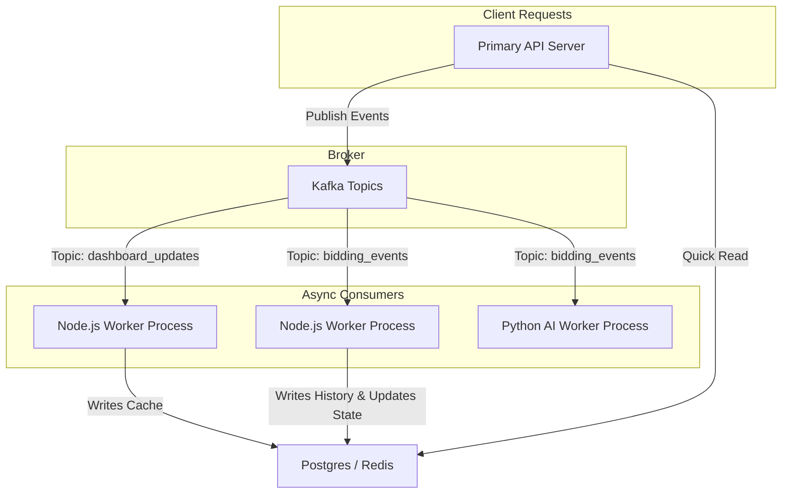

# Kafka Modular Architecture Plan

This plan outlines how to organize the codebase to separate the API Server from async Workers using Kafka, enabling you to scale workers independently.



---

## 1. Directory Structure

We will restructure the backend codebase to support modular publishers and consumers:

```text
Backend/src/
├── config/
│   └── kafka.config.ts           # Dynamic Connection manager for Kafka
├── workers/
│   ├── dashboard.worker.ts       # Recalculates stats via dashboard_updates topic
│   └── bidding.worker.ts         # Persists bids via bidding_events topic
├── server.ts                     # API Gateway (Publish-only, no consumers)
└── worker.ts                     # Master Worker Runner (Starts consumers)
```

---

## 2. Environment Characteristics (Local vs. Production)

| Feature / Note | Local Environment (Docker Compose) | Production Environment (Railway & Upstash) |
| :--- | :--- | :--- |
| **Broker Hosting** | Runs locally inside Docker (`apache/kafka:3.7.0`). | Serverless Managed Kafka via **Upstash** (free tier). |
| **Authentication** | None (Plaintext connection). | Mandatory (SCRAM-SHA-256 SASL authentication). |
| **Transport Security**| No TLS/SSL required. | TLS/SSL Connection mandatory. |
| **Listener Ports** | `9092` (Docker internal), `9094` (Local host machine). | Dynamic port provided by Upstash. |
| **Scaling Workers** | Bundled in a single `node-worker` to save RAM. | Separated into distinct containers and scaled via Replicas. |

---

## 3. Configuration Setup & Options

### Local Connection (.env)
```env
# Connect via external port if running code on host machine
KAFKA_BROKERS="localhost:9094"

# Connect via internal port if running code inside docker-compose
# KAFKA_BROKERS="kafka:9092"
```

### Production Connection (.env)
```env
KAFKA_BROKERS="your-upstash-endpoint.upstash.io:9092"
KAFKA_USERNAME="your_sasl_username"
KAFKA_PASSWORD="your_sasl_password"
```

---

## 4. Step-by-Step Integration Steps

### [Step 1] Create Standalone Worker Entrypoint
* **File:** `Backend/src/worker.ts`
* **Task:** Create a process entrypoint that only connects to Kafka and starts all registered consumer groups.

### [Step 2] Migrate Consumer Code to `/workers` Folder
* **Files:** Update [dashboard.worker.ts](file:///D:/HCMUS/Third%20Year/Ultra%20Web%20Skills/ReflourishedOnlineAuction/Online-Auction/Backend/src/workers/dashboard.worker.ts) to consume from Kafka topic `dashboard_updates` instead of RabbitMQ.
* **Files:** Implement `Backend/src/workers/bidding.worker.ts` to consume from Kafka topic `bidding_events`.

### [Step 3] Remove Worker Imports from Primary Server
* **File:** `Backend/src/server.ts`
* **Task:** Ensure [server.ts](file:///D:/HCMUS/Third%20Year/Ultra%20Web%20Skills/ReflourishedOnlineAuction/Online-Auction/Backend/src/server.ts) handles HTTP/WS connections and publishes tasks to Kafka but does not consume them.

### [Step 4] Add CLI Run Commands
* **File:** `Backend/package.json`
* **Task:** Add run commands to start the processes separately:
  ```json
  "scripts": {
    "dev": "tsx watch src/server.ts",
    "worker": "tsx watch src/worker.ts"
  }
  ```
