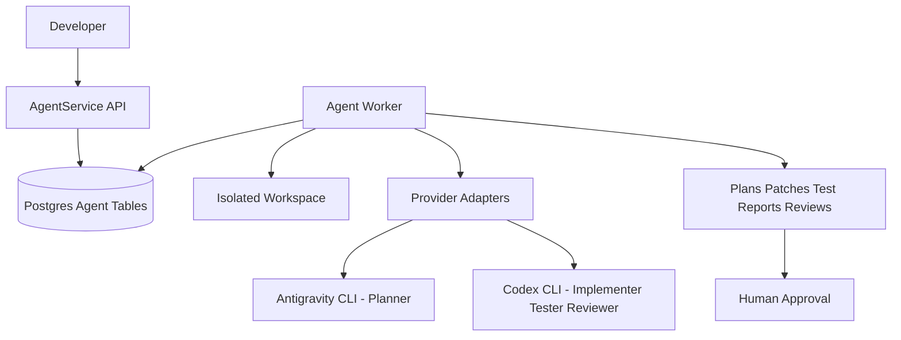

# Multi-Agent Coding Workflow

## Purpose

This multi-agent system is developer tooling for coding, review, testing, and development automation. It is not part of the Online Auction product runtime and does not directly affect the user-facing application.

Important boundaries:

- `Backend/` remains the auction product backend.
- `Frontend/` remains the auction product frontend.
- `AgentService/` is a separate development automation service inside the monorepo.
- AgentService creates isolated workspaces, runs provider CLIs separately, stores its own artifacts, and waits for human approval.
- V1 does not auto-push pull requests, auto-merge changes, or automatically modify the production database.

## Architecture Overview



## Core Components

### AgentService

AgentService is a standalone service under `AgentService/`. It has its own package, scripts, Dockerfile, environment configuration, and CI job.

Responsibilities:

- Accept code-change requests from the developer.
- Create agent runs and workflow steps in Postgres.
- Poll jobs from Postgres through a worker.
- Create an isolated workspace for each run.
- Invoke provider CLIs for each workflow step.
- Store plans, summaries, command audits, stdout/stderr, test reports, and review reports.
- Move completed runs to `waiting_approval` so the developer can decide what to do next.

### Postgres Job Store

V1 uses Postgres as the durable source of truth for the agent queue and lifecycle. The recommended local database is separate from the product database, for example `online_auction_agents`. Even when the same Postgres server is reused, agent data lives in `agent_*` tables and should not be mixed with auction business tables.

This project maps local infrastructure to non-default host ports to avoid conflicts with other Docker projects:

- Postgres: `localhost:15432`
- Redis: `localhost:16379`
- Kafka external listener: `localhost:19094`

Main tables:

- `agent_runs`: task, status, current step, provider mapping, token budgets.
- `agent_steps`: each workflow step, status, attempts, and error details.
- `agent_artifacts`: plan, context pack, test report, review report, stdout/stderr.
- `agent_command_audits`: executable, args, cwd, exit code, and duration.
- `agent_approvals`: human approval or rejection records.

Kafka is not used for the V1 agent queue. It can be added later for event streaming or log streaming if the system needs it.

### Provider Adapters

Providers are wrapped behind a common adapter interface:

- `run(input, context)`
- `validateAvailability()`
- `capabilities`

Default mapping:

- Planner: Antigravity
- Implementer: Codex
- Tester: Codex
- Reviewer: Codex

Claude Code is planned as a future adapter option, but V1 does not need to implement it yet.

## V1 Workflow

### 1. Queued

The developer creates a run through the API. The service validates the request and stores it in Postgres.

Endpoint:

- `POST /api/agent-runs`

Local helper:

- `.\agent-task.bat`

The helper prompts for a task, creates a run, prints status and artifact URLs, and polls progress from the terminal.

### 2. Context Indexing

This is a deterministic step, not an AI-heavy step.

Responsibilities:

- Scan the relevant file manifest.
- Read package scripts.
- Build a compact context pack.
- Store the `context_pack` artifact and a handoff summary.

The goal is token efficiency: agents should not receive the full repository, full logs, or raw history.

### 3. Planning

Antigravity receives:

- The developer task.
- A compact repository summary.
- A targeted file manifest.
- Package scripts.
- A token budget.

Output:

- Implementation plan.
- Target files.
- Test commands.
- Risk notes.
- Handoff summary.

If `ANTIGRAVITY_CLI_PATH` is missing or the CLI is unavailable, the run fails with `PROVIDER_UNAVAILABLE`.

### 4. Implementing

Codex receives:

- The generated plan.
- Required context.
- An isolated workspace.
- Its own token budget.

Codex applies changes inside the isolated workspace. It does not run directly against the production application runtime.

### 5. Testing

Codex or a deterministic runner performs verification.

Default priority:

- Build the affected package.
- Run focused tests when available.
- Store only useful failure excerpts instead of large raw logs.

### 6. Reviewing

Codex reviews:

- Final diff.
- Plan adherence.
- Test evidence.
- Risks and blocking findings.

The output is stored as a review report artifact.

### 7. Waiting Approval

The run stops at `waiting_approval`.

The developer reviews artifacts and decides:

- Approve: `POST /api/agent-runs/:id/approve`
- Cancel: `POST /api/agent-runs/:id/cancel`

V1 does not auto-merge or auto-push pull requests.

## API V1

- `POST /api/agent-runs`: create a run.
- `GET /api/agent-runs/:id`: get run status.
- `GET /api/agent-runs/:id/artifacts`: list run artifacts.
- `POST /api/agent-runs/:id/approve`: approve a run waiting for approval.
- `POST /api/agent-runs/:id/cancel`: cancel a queued or running run.
- `GET /health`: process health.
- `GET /ready`: dependency readiness.

Responses use a consistent envelope:

```json
{ "success": true, "data": {} }
```

or:

```json
{ "success": false, "error": { "code": "ERROR_CODE", "message": "...", "requestId": "..." } }
```

## Safety Rules

AgentService must execute commands with strict guardrails:

- Do not use arbitrary shell strings.
- Use executable plus args arrays.
- Give each run an isolated workspace.
- Enforce command timeouts.
- Cap stdout/stderr output size.
- Redact secrets from logs.
- Record command audits.
- Persist patch/diff and reports before approval.
- Do not directly affect the production runtime.

## Token Strategy

The default strategy is budgeted summaries:

- Context Indexer creates a compact manifest and summary.
- Planner does not receive the full repository.
- Implementer receives only the plan and required context.
- Tester receives only the patch, test command context, and failure excerpts.
- Reviewer receives the final diff, plan, and test summary.
- Each step writes a handoff summary for the next step.

## Run Statuses

Main statuses:

- `queued`
- `context_indexing`
- `planning`
- `implementing`
- `testing`
- `reviewing`
- `waiting_approval`
- `succeeded`
- `failed`
- `cancelled`
- `timed_out`

## Test Plan

Automated tests should cover:

- Provider adapter command construction.
- Token budget and context pack trimming.
- Run state transitions.
- Sandbox path guard.
- Output truncation.
- Provider unavailable errors.
- Cancelling queued or running runs.
- Failed step audit and terminal status.

Manual smoke checks:

```powershell
cd AgentService
npm test
```

```powershell
docker compose config
```

After applying the migration and starting Postgres:

```powershell
curl http://localhost:8010/health
curl http://localhost:8010/ready
```

## Summary

The multi-agent platform is a developer support layer inside the monorepo. It helps plan, implement, test, review, and audit code-change workflows. It is intentionally separated from the auction backend so it does not add risk or complexity to the main product runtime.
