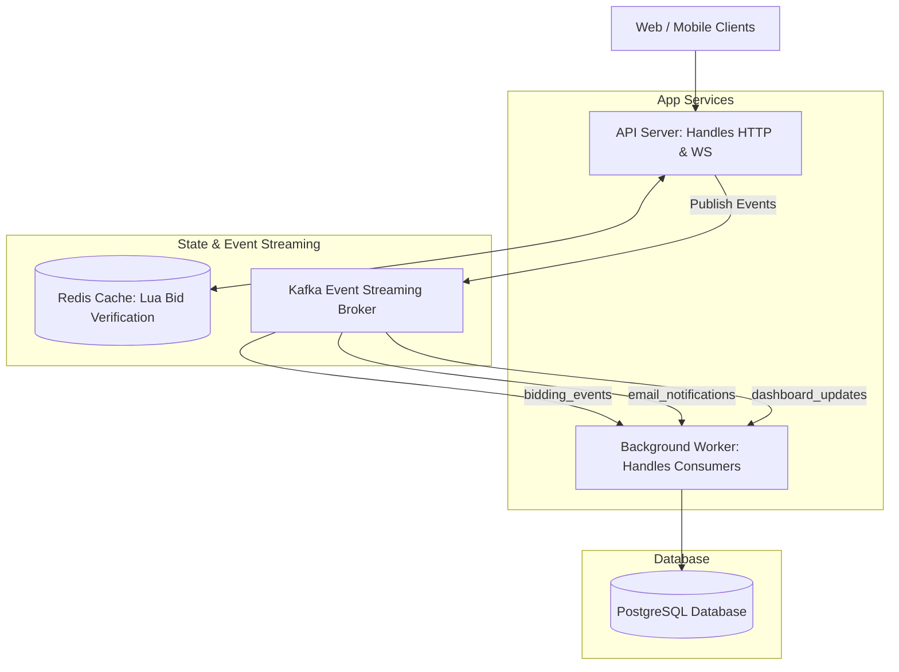

# Overview System Architecture: High-Throughput Online Auction Platform

This document describes the unified system architecture designed to handle **1,000+ requests per second (req/sec)** using in-memory validation (Redis) and an asynchronous queue-based write-behind worker pattern.

---

## 1. Unified Architecture Topology

The system topology maps the actual deployment layout (1 API Gateway/Server, 1 Redis Cache, 1 Kafka Event Streaming Broker, 1 Worker, and 1 PostgreSQL Database):



---

## 2. Component Directory & Deployment Breakdown

The codebase is structured as a **Modular Monolith** where the API Server and the Worker share the same repository but run as separate container processes in production:

| Component | Production Role | Host/Service Platform | Local Instance (Docker) |
| :--- | :--- | :--- | :--- |
| **Frontend** | Delivers static web assets. | Vercel | Local Port `5173` |
| **API Server** | Verifies bids via Redis & pushes jobs to Kafka. | Railway (Web Service) | Local Port `5000` |
| **Worker Process** | Consumes tasks (Emails, DB Writes, Dashboards). | Railway (Worker Service) | Background worker container |
| **Redis** | Fast in-memory state & atomic Lua scripts. | Railway Redis | Local Port `6379` |
| **Kafka** | Event Streaming Broker routing events to topics. | Upstash Kafka | Local Port `9092` |
| **PostgreSQL** | Permanent ACID-compliant system storage. | Railway PostgreSQL | Local Port `5432` |

---

## 3. High-Throughput Mechanism (1,000+ req/sec)

Under the pessimistic locking model, requests queue behind database row-locks (`SELECT FOR UPDATE`), failing at high volume. This unified architecture achieves high throughput via:

1. **In-Memory Validation (Redis + Lua Script):**
   * The API Server forwards bid validations directly to Redis.
   * Redis evaluates bid prices and timestamps atomically via single-threaded Lua scripting, responding in $<1$ millisecond.
   * Invalid bids are rejected immediately without hitting the database.

2. **Asynchronous Write-Behind (Kafka + Worker):**
   * Validated bids are published to the `bidding_events` topic in Kafka.
   * The API Server returns a success response to the client immediately.
   * The background `Worker` consumes the events at its own pace and writes them safely to PostgreSQL, shielding the database from peak traffic surges.

---

## 4. Scaling the Worker

If background message volumes grow under high load, you can scale the worker capacity without modifying the code or adding new databases:

* **Locally:** Scale the worker service to 3 parallel containers:
  ```bash
  docker compose up --scale worker=3 -d
  ```
* **In Production (Railway):** Go to your **Worker Service** settings and increase the **Replicas** count. Railway will run duplicate worker containers that share the consumer group load using Kafka's automatic partition distribution.

---

## 5. Environment Configuration Setup

Toggle between local development and production environments using your environment variables:

```bash
# Run locally (defaults to localhost connection URLs in .env)
npm run dev

# Deploy to production (injects cloud service connection URLs via Railway Variables)
NODE_ENV=production npm run start
```
