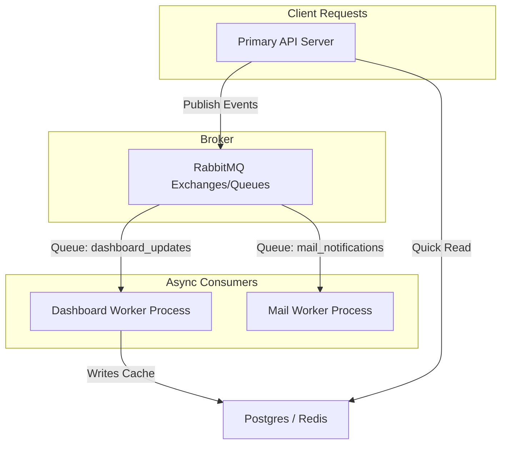

# RabbitMQ Modular Architecture Plan

This plan outlines how to organize the codebase to separate the API Server from async Workers, enabling you to scale workers independently.



---

## 1. Directory Structure

We will restructure the backend codebase to support modular publishers and consumers:

```text
Backend/src/
├── config/
│   └── rabbitmq.config.ts        # Dynamic Connection manager
├── workers/
│   ├── dashboard.worker.ts       # Recalculates stats
│   └── mail.worker.ts            # Sends emails
├── server.ts                     # API Gateway (Publish-only, no consumers)
└── worker.ts                     # Master Worker Runner (Starts consumers)
```

---

## 2. Step-by-Step Integration Steps

### [Step 1] Create Standalone Worker Entrypoint
* **File:** `Backend/src/worker.ts`
* **Task:** Create a process entrypoint that only connects to RabbitMQ and starts all registered queue consumers.

### [Step 2] Migrate Consumer Code to `/workers` Folder
* **Files:** Move `Backend/src/modules/dashboard/dashboard.consumer.ts` to `Backend/src/workers/dashboard.worker.ts` and clean up dependencies.

### [Step 3] Remove Worker Imports from Primary Server
* **File:** `Backend/src/server.ts`
* **Task:** Revert `server.ts` so it handles HTTP connections and publishes tasks but does not consume them.

### [Step 4] Add CLI Run Commands
* **File:** `Backend/package.json`
* **Task:** Add run commands to start the processes separately:
  ```json
  "scripts": {
    "dev": "tsx watch src/server.ts",
    "worker": "tsx watch src/worker.ts"
  }
  ```
