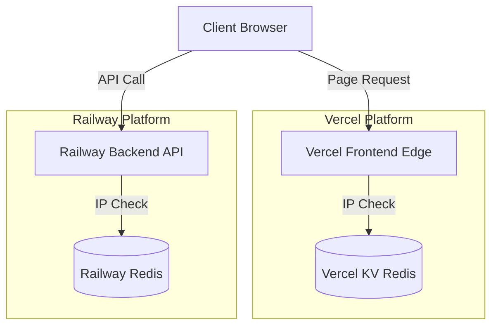

# Rate Limiting Implementation Plan

This document outlines the strategy for implementing rate limiting across the Vercel frontend and Railway backend to protect services from abuse.

## 1. System Architecture



## 2. Implementation Steps

### Step 1: Backend Rate Limiting (Railway)
1. Install dependencies in the Backend project:
   ```bash
   npm install express-rate-limit rate-limit-redis ioredis
   ```
2. Configure trust proxy setting and setup Redis connection in [server.ts](file:///D:/HCMUS/Third%20Year/Ultra%20Web%20Skills/ReflourishedOnlineAuction/Online-Auction/Backend/src/server.ts).
3. Apply `rateLimit` middleware to all public incoming endpoints.

### Step 2: Frontend Rate Limiting (Vercel)
1. Provision a Vercel KV instance through the Vercel Dashboard.
2. Install rate limiting helpers in the Frontend project:
   ```bash
   npm install @upstash/ratelimit @vercel/kv
   ```
3. Create a `middleware.ts` file in the frontend root directory.
4. Set rate limit threshold rules (e.g., 60 requests per minute).

## 3. Configuration Profiles

| Layer | Environment | Technology | Limit Threshold |
| :--- | :--- | :--- | :--- |
| **Frontend** | Vercel Edge | `@upstash/ratelimit` | 60 requests / minute |
| **Backend** | Railway | `express-rate-limit` | 100 requests / 15 minutes |
