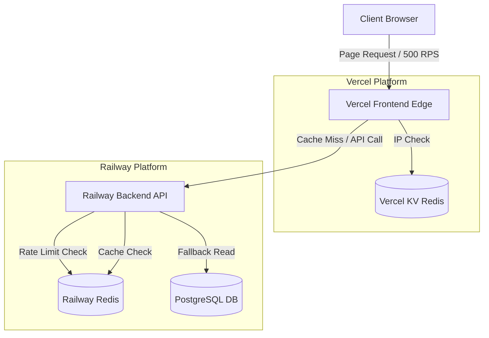

# Rate Limiting & High-Throughput Implementation Plan

This document outlines the optimized strategy for implementing rate limiting across the Vercel frontend and Railway backend to protect services from abuse while supporting high throughput (up to 30,000 requests/minute / 500 RPS).

## 1. System Architecture



---

## 2. Configuration Profiles

To prevent legitimate users from being blocked while protecting our server resources, we use segmented rate limiters instead of a single global limit.

| Layer | Environment / Route | Technology | Limit Threshold | Purpose |
| :--- | :--- | :--- | :--- | :--- |
| **Frontend** | Edge Middleware (Non-static) | `@upstash/ratelimit` | 60 requests / 10 seconds | Prevents DDoS at edge |
| **Backend** | Public Read APIs (`/products`, `/categories`, etc.) | `express-rate-limit` + Redis | 300 requests / 1 minute | Allows fast browsing |
| **Backend** | Auth Actions (`/accounts/login`, etc.) | `express-rate-limit` + Redis | 10 requests / 5 minutes | Prevents brute force |
| **Backend** | Bid Submissions (`/bids`) | `express-rate-limit` + Redis | 60 requests / 1 minute | Prevents bid spamming |
| **WebSockets** | Socket.io bidding room | Custom event throttling | Min 200ms per event | Blocks message flood |

---

## 3. Implementation Steps

### Step 1: Backend Segmented Rate Limiting (Railway)
1. Install dependencies in the Backend project:
   ```bash
   npm install express-rate-limit rate-limit-redis ioredis
   ```
2. Configure proxy trust in [server.ts](file:///D:/HCMUS/Third%20Year/Ultra%20Web%20Skills/ReflourishedOnlineAuction/Online-Auction/Backend/src/server.ts):
   ```typescript
   app.set("trust proxy", 1);
   ```
3. Implement and apply segmented limiters to respective route groups in the backend router.
4. Ensure the Redis rate limiter is executed **before** authentication checks and database queries to reject blocked requests with minimal CPU overhead.

### Step 2: Backend Read-Path Caching
1. Implement a **Cache-Aside** strategy using Redis for high-traffic read endpoints (e.g., categories, active products, settings).
2. Set explicit Time-To-Live (TTL) policies and invalidate cached data on writes (e.g., when a new bid is placed or a product is updated).
3. Ensure database queries degrade gracefully if Redis encounters an outage.

### Step 3: Frontend Rate Limiting (Vercel)
1. Provision a Vercel KV instance through the Vercel Dashboard.
2. Install rate limiting helpers in the Frontend project:
   ```bash
   npm install @upstash/ratelimit @vercel/kv
   ```
3. Create a `middleware.ts` file in the frontend root directory.
4. **Crucial Optimization**: Configure the middleware matcher to exclude static assets (images, CSS, JS, favicons) to avoid false-positive blocks:
   ```typescript
   export const config = {
     matcher: ['/((?!api|_next/static|_next/image|favicon.ico).*)'],
   };
   ```
5. Use `@upstash/ratelimit`'s `ephemeralCache` to save Upstash Redis call cost and latency:
   ```typescript
   const ratelimit = new Ratelimit({
     redis: kv,
     limiter: Ratelimit.slidingWindow(60, "10 s"),
     ephemeralCache: new Map(), // Local in-memory cache for edge instances
   });
   ```

### Step 4: Socket.io Rate Limiting
1. For WebSocket connection event handlers, track the timestamp of the last message received from each socket ID.
2. Reject incoming event payloads if the sender's transmission frequency exceeds the configured limit (e.g., more than 5 events/second).
